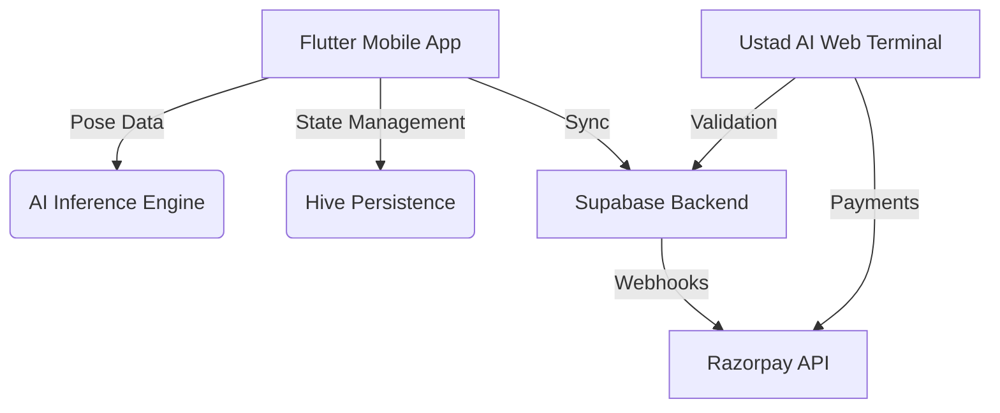

# 🛡️ KASRAT AI | USTAD AI
> **DISCIPLINE AS A SERVICE.**

---

## ⚡ MISSION OBJECTIVE
**KASRAT AI** is not a fitness app. It is a high-stakes discipline protocol designed to eliminate weakness and enforce consistency through AI-validated physical accountability and financial collateral.

In an era of endless distractions, **USTAD AI** serves as your digital drill sergeant, ensuring that your commitments are met—or your collateral is forfeit.

---

## 🛠️ CORE PROTOCOLS

### 1. AI Physical Validation (The Fauj Engine)
*   **Real-time Pose Tracking:** Using high-frequency (10 FPS optimized) camera inference to detect movement patterns.
*   **Anti-Exploit Logic:**
    *   **Pelvis Drop Protocol:** Hip displacement tracking to ensure deep squat depth.
    *   **Flight Ceiling Protocol:** Dynamic shoulder tracking to verify airborne phases in jumps.
*   **Hardware:** Optimized for cross-orientation stability and mobile edge computing.

### 2. The Alarm Protocol
*   **Discipline Enforcement:** Alarms that cannot be ignored without consequence.
*   **120s Kill Switch:** Users have 120 seconds to begin their mission upon wake-up.
*   **Failure Penalty:** Failure to complete the assigned movement block triggers a formal collateral forfeit via the Supabase backbone.

### 3. Skin in the Game (Collateral Model)
*   **Manual Authentication:** A web-based "Digital Tollbooth" for collateral deposits (bypass in-app billing for maximum compliance).
*   **Regionalized Pricing:** Dynamic support for domestic (INR) and international (USD) stakes.
*   **Payment Rails:** Integrated with Razorpay for secure, multi-currency collateral handling.

---

## 🏗️ SYSTEM ARCHITECTURE

### Tech Stack
- **Frontend (Mobile):** Flutter (Dart) - *Military Brutalist UI*
- **Frontend (Web):** Next.js / Vite (TailwindCSS/Vanilla CSS) - *Terminal Interface*
- **Backend:** Supabase (Auth, Postgres, Real-time)
- **AI:** Google ML Kit / Pose Detection
- **Database:** Hive (Local) & Supabase (Cloud)
- **Payments:** Razorpay (Manual Web Funnel)

---

## 🚀 DEPLOYMENT & SETUP

### Mobile Client (Flutter)
1. Ensure Flutter SDK is installed.
2. Clone the repository.
3. Configure `CommercialConstants` in `lib/core/constants/app_constants.dart` with your regional collateral amounts.
4. Run `flutter pub get`.
5. Execute `flutter run`.

### Web Terminal (Next.js)
1. Navigate to `/kasrat_web`.
2. Run `npm install`.
3. Configure `.env` with Supabase and Razorpay credentials.
4. Run `npm run dev`.

---

## 🛡️ COMPLIANCE & SECURITY
The system architecture follows a **Manual Web Authentication** model. All financial transactions are handled externally via the Ustad AI Web Terminal to ensure platform compliance and transparent collateral management.

---

## 💀 STATUS: OPERATIONAL
> *"Discipline is the bridge between goals and accomplishment."*

**KASRAT AI | ENFORCING THE STANDARD.**
